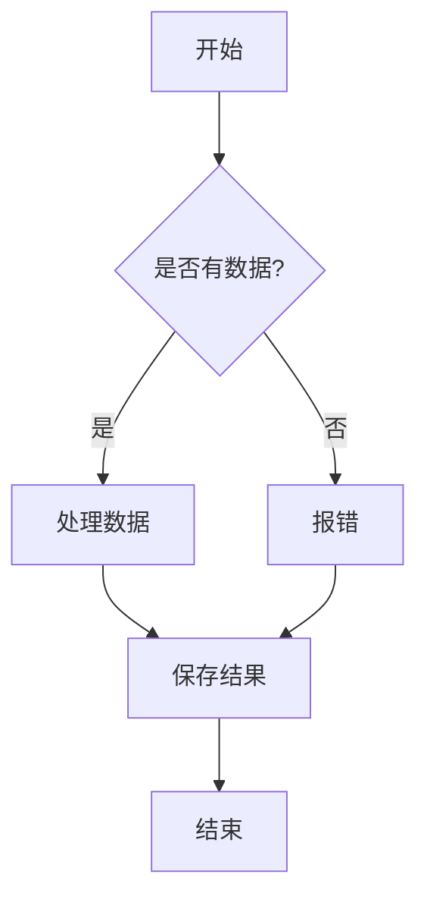

#### Markdown 语法全要素测试文档

这是一篇旨在测试 Markdown 渲染能力的综合性文档。它涵盖了从基础排版到高级语法（如数学公式、图表和代码高亮）的所有常用元素。

#### 1. 基础排版与文本样式

Markdown 的核心在于其简洁的文本格式化能力。以下是常用文本样式的展示：

- **粗体文本**：用于强调重点内容。
- *斜体文本*：用于表示引用、术语或轻微的强调。
- ***粗斜体***：用于极度强调。
- ~~删除线~~：用于表示已废弃或不再相关的内容。
- **嵌套样式**：你可以**在粗体中包含*斜体*文本**，反之亦然。

> **引用块**
>
> 这是第一层引用。引用块常用于展示名言、代码注释或邮件回复。
>
> > 这是第二层嵌套引用。
> >
> > 它可以无限嵌套，以区分不同的对话层级或逻辑层次。

#### 2. 列表与任务管理

有序列表和无序列表是组织信息的基础工具。

**无序列表：**

- 第一项：使用 `-`、`+` 或 `*` 作为标记。
- 第二项：支持**行内格式**。
- 第三项：包含子列表。
    - 子项 A：通过缩进（通常是 2 或 4 个空格）创建。
    - 子项 B：保持对齐。

**有序列表：**

1. 步骤一：首先，准备环境。
2. 步骤二：其次，编写代码。
    1. 子步骤：安装依赖。
    2. 子步骤：运行测试。
3. 步骤三：最后，部署上线。

**任务列表（GFM 扩展）：**

- [x] 已完成的任务
- [ ] 待办事项 A
- [ ] 待办事项 B

#### 3. 代码块与语法高亮

技术博客的核心。Markdown 支持行内代码和带有语法高亮的多行代码块。

**行内代码：**
请在终端运行 `npm install` 来安装依赖。变量 `$PATH` 指向系统目录。

**多行代码块（Python 示例）：**

```python
import time

def countdown(seconds):
    """
    一个简单的倒计时函数
    """
    while seconds:
        mins, secs = divmod(seconds, 60)
        timer = '{:02d}:{:02d}'.format(mins, secs)
        print(timer, end="\r")
        time.sleep(1)
        seconds -= 1
    print("时间到！")

countdown(10)
```

**JSON 数据示例：**

```json
{
  "user": "admin",
  "version": "1.0.0",
  "features": ["markdown", "latex", "diagrams"],
  "active": true
}
```

#### 4. 数学公式

对于学术或技术文档，数学公式的支持至关重要。

**行内公式：**
当 $a \ne 0$ 时，方程 $ax^2 + bx + c = 0$ 有两个解，可以通过求根公式 $x = \frac{-b \pm \sqrt{b^2 - 4ac}}{2a}$ 求得。

**独立公式块：**
以下是欧拉恒等式，被许多数学家认为是数学中最美丽的公式：

$$
e^{i\pi} + 1 = 0
$$

复杂的矩阵与求和示例：

$$
\mathbf{A} = \begin{pmatrix}
\alpha_{11} & \cdots & \alpha_{1n} \\\\
\vdots & \ddots & \vdots \\\\
\alpha_{n1} & \cdots & \alpha_{nn}
\end{pmatrix}
$$

$$
P(E) = {n \choose k} p^k (1-p)^{n-k}
$$

#### 5. 表格

表格用于展示结构化数据。

| 特性 | 支持情况 | 优先级 | 备注 |
| :--- | :---: | :---: | :--- |
| **标题** |  支持 | 高 | 必须清晰 |
| *对齐* |  支持 | 中 | 左、中、右 |
| 链接 |  支持 | 高 | [示例](#) |
| 图片 |  支持 | 极高 | 需优化加载 |

#### 6. 链接与图片

- **普通链接**：访问 [GitHub](https://github.com) 获取更多信息。
- **带标题的链接**：[MDN Web Docs](https://developer.mozilla.org "Web 技术文档")。
- **图片引用**：
    - 语法：``
    - 示例：


#### 7. 脚注

这是一个带有脚注的句子[^1]。脚注可以让读者在不打断阅读流的情况下获取额外信息。

[^1]: 这是脚注的具体内容，通常显示在文章底部。

#### 8. 流程图

使用 Mermaid 语法绘制流程图，展示逻辑关系。



#### 9. 水平分割线

使用三个或更多的 `*`、`-` 或 `_` 可以创建分割线，用于区分章节。

---


